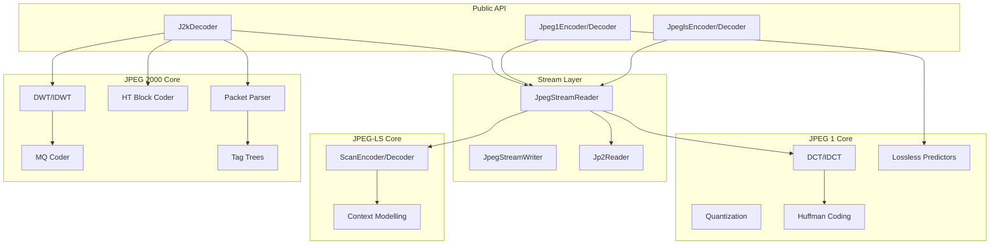

# Architecture of jpegexp-rs

This document describes the internal design and data flow of the `jpegexp-rs` library.

## Module Hierarchy

## Module Descriptions

### 1. Public API Layer
- **`jpegls/encoder.rs`, `jpegls/decoder.rs`**: JPEG-LS encoding/decoding.
- **`jpeg1/encoder.rs`, `jpeg1/decoder.rs`**: JPEG 1 Baseline, Progressive, and Lossless.
- **`jpeg2000/decoder.rs`**: JPEG 2000 and HTJ2K decoding with JP2 container support.

### 2. Stream Layer
- **`jpeg_stream_reader.rs`**: Parses JPEG markers (SOI, SOF, SOS, DQT, DHT, DRI, etc.).
- **`jpeg_stream_writer.rs`**: Writes JPEG markers and segment data.
- **`jpeg2000/jp2.rs`**: Parses JP2 container boxes (Annex I), extracts codestream.

### 3. JPEG-LS Core (`jpegls/`)
- **`scan_encoder.rs`, `scan_decoder.rs`**: JPEG-LS predictive coding loop.
- **`regular_mode_context.rs`, `run_mode_context.rs`**: Golomb-Rice context models.

### 4. JPEG 1 Core (`jpeg1/`)
- **`dct.rs`**: Forward/Inverse DCT (8x8 blocks).
- **`quantization.rs`**: Quantization/dequantization with standard tables.
- **`huffman.rs`**: Huffman encoding/decoding, standard DC/AC tables.
- **`lossless.rs`**: Process 14 predictors (1-7) for lossless JPEG.

### 5. JPEG 2000 Core (`jpeg2000/`)
- **`dwt.rs`**: 5-3 reversible and 9-7 irreversible wavelet transforms.
- **`mq_coder.rs`**: MQ arithmetic coder for EBCOT.
- **`bit_plane_coder.rs`**: Context modeling for significance/refinement passes.
- **`tag_tree.rs`**: Hierarchical tree for inclusion/zero bit-plane coding.
- **`packet.rs`**: Packet header parsing and PrecinctState management.
- **`parser.rs`**: Main header parsing (SOC, SIZ, COD, QCD, CAP).
- **`ht_block_coder/`**: HTJ2K non-iterative block coder (MEL, VLC, MagSgn).

## Data Flow

### JPEG-LS Encoding
1. User provides raw pixels → `JpeglsEncoder` writes markers.
2. `ScanEncoder` processes line-by-line: predict → compute error → Golomb encode.
3. Bit-stream packed with FF00 stuffing.

### JPEG 1 Decoding (Baseline/Progressive)
1. `Jpeg1Decoder` reads SOF0/SOF2/SOF3 → determines mode.
2. For Progressive: accumulate coefficients in `coefficient_buffers` across scans.
3. Apply IDCT → color conversion → output pixels.

### JPEG 2000/HTJ2K Decoding
1. `J2kDecoder` checks for JP2 container → extracts codestream.
2. `J2kParser` parses main header (SIZ, COD, QCD, CAP).
3. For each tile: `decode_tile_data` iterates packets in progression order (LRCP/RPCL).
4. Block coder (MQ or HT) recovers coefficients → IDWT → output.

## Generic Sample Handling
The `JpeglsSample` trait enables efficient handling of 8-bit and 16-bit samples:
- Defines numerical operations and conversions.
- Allows compiler to generate optimized code for both bit depths.
