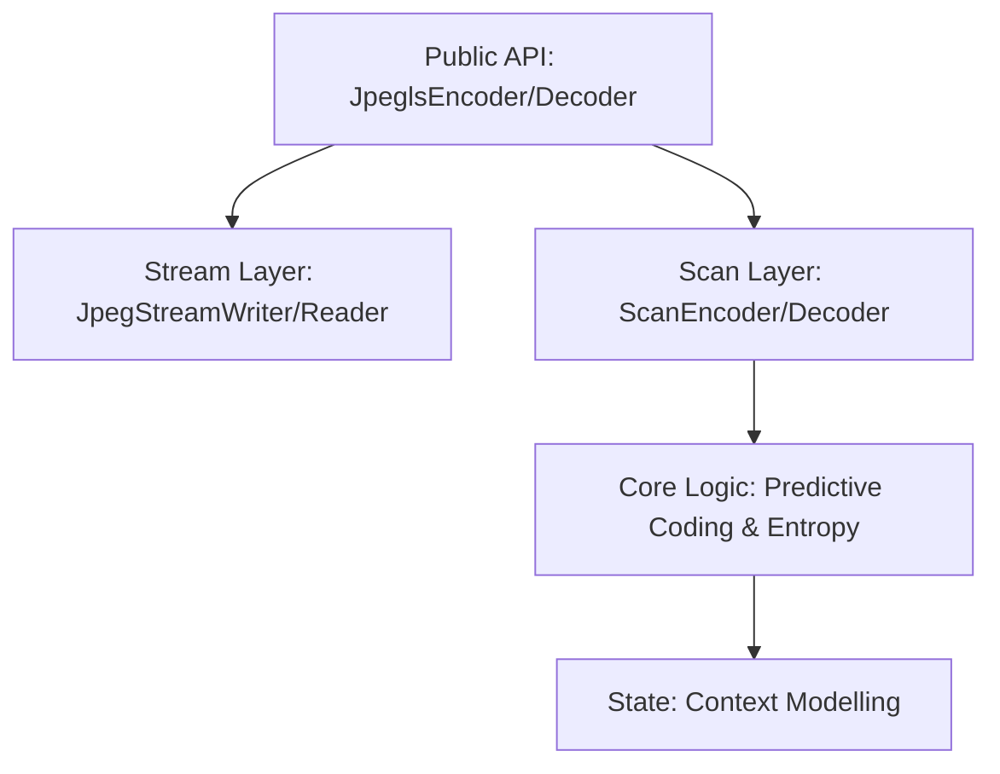

# Architecture of jpegexp-rs

This document describes the internal design and data flow of the `jpegexp-rs` library.

## Module Hierarchy

### 1. Public API Layer (`encoder.rs`, `decoder.rs`)
These modules provide the primary entry points for users. They manage the high-level orchestration:
- Opening buffers.
- Dispatching to typed encoding/decoding based on bit-depth.
- Managing overall frame metadata.

### 2. Stream Layer (`jpeg_stream_writer.rs`, `jpeg_stream_reader.rs`)
Responsible for the JPEG-LS file format structure:
- Writing/reading markers (SOI, SOF, SOS, etc.).
- Handling SPIFF headers.
- Byte-level encapsulation of compressed scans.

### 3. Scan Layer (`scan_encoder.rs`, `scan_decoder.rs`)
The heart of the JPEG-LS algorithm. It implements:
- Predictive coding loop (line-by-line, pixel-by-pixel).
- Run-mode detection and handling.
- Bit-stream packing/unpacking (including FF00 stuffing).
- Generic support for `u8` and `u16` samples via traits.

### 4. Context Modelling (`regular_mode_context.rs`, `run_mode_context.rs`)
Maintains the statistical models used by the Golomb coding:
- `A`, `B`, `C`, `N` variables for predictive bias and Golomb parameter estimation.
- `update_variables` logic for adapting to local image statistics.

## Data Flow (Encoding)

1. User provides raw pixel data and metadata.
2. `JpeglsEncoder` writes JPEG markers to the destination buffer.
3. `ScanEncoder` is initialized with the raw source.
4. For each sample:
    - Determine if in Run Mode or Regular Mode.
    - **Regular Mode**: Predict value based on neighbors -> Compute error -> Golomb encode.
    - **Run Mode**: Count identical pixels -> Encode run length -> Handle interruption pixel.
5. Bit-stream is packed into bytes and written to the writer.

## Data Flow (Decoding)

1. `JpeglsDecoder` reads markers from the source buffer.
2. Frame and scan parameters are parsed.
3. `ScanDecoder` is initialized with the remaining bit-stream.
4. For each sample:
    - Predict next value -> Determine mode.
    - Golomb decode error or run length.
    - Reconstruct final pixel value.
5. Decompressed pixels are written to the user-provided slice.

## Generic Sample Handling
To avoid duplicating logic for 8-bit and 16-bit images, the library relies on the `JpeglsSample` trait:
- Defines numerical operations and conversions.
- Specializes certain edge-case math for different bit-depths.
- Allows the compiler to generate optimized machine code for both cases while maintaining a single implementation.
